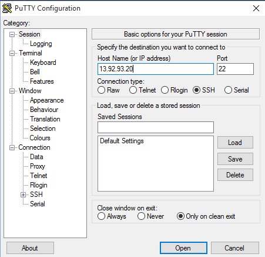
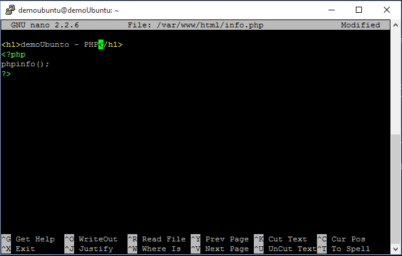

# Ubunto como Servidor PHP, Apache y MySql

<p></p>

##Objetivo del laboratorio
1. Desplegar una máquina virtual Linux como servidor (PHP, Apache y MySql) con phpMyAdmin para fácil administración utilizando LAMP

##Requisitos 
1. Una cuenta de Azure Activa (si no tiene una puede acceder a una gratis <b><a href="https://azure.microsoft.com/es-es/pricing/free-trial/">Azure Free Trial</a></b> )
1. Descargar cliente <a href="https://the.earth.li/~sgtatham/putty/latest/x86/putty.exe">PuTTY<a> para conexiones SSH.

##Parte 1 - Creación de Máquina Virtual

Para crear la máquina virtual ingresamos con la cuenta de Azure el <a href="portal.azure.com">portal<a>

1. Procedemos a crea la maquina seleccionando Nuevo, Proceso, Ubuntu Server 14.04 LTS y Crear.
    
    

1. Características de máquina virtual
Vamos a crear la máquina virtual con requisitos mismos para el laboratorio.
* Configuración básica
    
* Tamaño
    
* Configuración básica
    
* Resumen
    
* Máquina virtual Creada
    
    
 Con esto hemos creado la máquina virtual de forma exitosa (Este proceso debe tardar alrededor de 5 min)

##Parte 2 - Conexión SSH Máquina Virtual

1. Buscamos la dirección IP de nuestro servidor Ubuntu teniendo en cuenta la anterior imagen:
        

1. Para este paso debemos haber descargado putty, aquí le dejo el <a href="https://the.earth.li/~sgtatham/putty/latest/x86/putty.exe">enlace<a>
Procedemos a ejecutarlo e ingresamos la Ip como se ve en la Imagen y Click en Open
        
1. Mensaje de Seguridad, le damos click en Yes
        
1. Ingresamos Usuario y Clave
        
        
* Conexión exitosa
        

##Parte 3 - Instalación servidor Lamp (Apache, PHP y MySql)
1. Actualización de repositorios, si solicita la clave la ingresamos nuevamente.
```Linux
    sudo apt-get update
    //luego actualizamos componentes
    sudo apt-get upgrade
```
* Actualización repositorios update
        
* Actualización repositorios upgrade
        
1. Instalación de Servidor lamp
```Linux
    sudo tasksel
```
Nos desplazamos con la flecha abajo hasta [ ] LAMP Server  y la seleccionamos con barra espaciadora quedando asi [*] LAMP Server, tab y enter
        
* Clave usuario root, pide confirmación
        
* Proceso instalación 2 min
     
1. Ahora vamos a habilitar los puertos del servidor para poder acceder por http:// (puerto 80)
 *  Nos desplazamos al menú grupos de Recursos y seleccionamos el recurso "demoUbuntu"
      
 *  Seleccionamos Grupo de Seguridad de red
        
 *  Seleccionamos en la columna derecha Reglas de seguridad de entrada
        
 *  Agregamos uno nueva regla de entrada agregando nombre y regla de puerto, en este caso habilite todos los puertos con "*"
        
 *  Creación  exitosa
        
1. Validación de acceso y funcionalidad de servidor apache y php
Crearemos un archivo php con la siguiente instrucción:
```Linux
     sudo nano /var/www/html/info.php
```
Ingresamos la siguiente instrucción
```php
    <h1>demoUbunto - PHP<h1>
    <?php
    phpinfo();
    ?>
```
        
 Luego presionas "control + x", la tecla "y" y "enter" para guardar los cambios
 Para validar que este correcto nos dirigimos al navegador y copiamos http://[dirección ip]/info.php
        
 Con esto terminamos de validar servidor php y apache.

##Parte 4 - Instalacion phpMyAdmin
 Para instalar phpmyadmin ejecutamos el siguiente comando:

```Linux
   sudo apt-get install phpmyadmin
```
* Nos pide confirmar descarga de librarías adicionales, presionamos la tecla "y"
        
* Seleccionamos servidor apache2 y aceptamos la configuración
    
* Presionamos enter para confirmar la configuración del archivo dbconfig-common 
    
* Ingresamos la clave del usuario root de MySql, recordar el paso 2 de la parte 3 
    
* Para validar que este correcto nos dirigimos al navegador y copiamos http://[dirección ip]/phpmyadmin/
       
       
    
Espero que el laboratorio les sea de ayuda
Recuerda visitar mis sitios: 
* <a hreft="http://juanrendon.net">http://juanrendon.net<a>
* <a hreft="https://www.facebook.com/azurecolombia/">https://www.facebook.com/azurecolombia/<a>
* <a hreft="https://github.com/yovento/Azure-Colombia/">https://github.com/yovento/Azure-Colombia/<a>
 